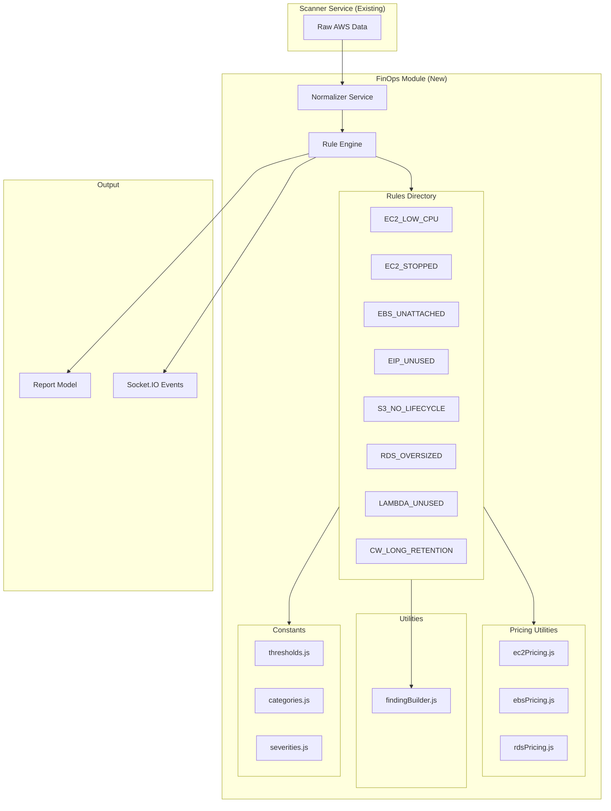
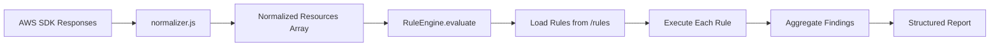
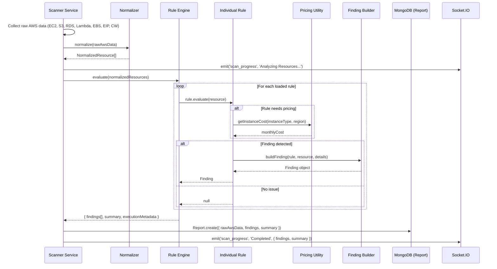
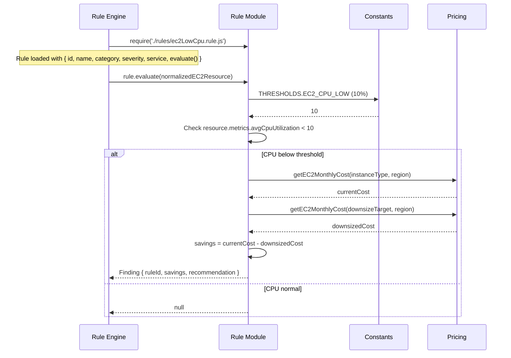

# Design Document: FinOps Rule Engine

## Overview

The FinOps Rule Engine is a deterministic, pure-function analysis module that evaluates normalized AWS resource data against a set of cost-optimization rules and produces structured findings. It sits between the AWS Discovery Engine (which collects raw infrastructure data) and the reporting layer (which persists and displays results). The Rule Engine replaces the existing Gemini/AI-based analysis for cost optimization, guaranteeing reproducible output — given identical input, it always produces identical findings.

The engine follows a plugin architecture where each rule is an independent module loaded automatically from the `rules/` directory. Rules never interact with each other and never call external services. A pricing subsystem provides static cost lookup tables so rules can estimate savings without calling AWS Pricing APIs. The normalizer service transforms raw AWS SDK responses into a uniform resource format that rules evaluate against.

This module is fully unit-testable in isolation, introduces no new npm dependencies, and uses CommonJS throughout to match the existing codebase.

## Architecture

### System Architecture



### Data Flow Architecture



## Sequence Diagrams

### Full Scan Flow with Rule Engine



### Rule Execution Detail



## Components and Interfaces

### Component 1: Rule Engine

**Purpose**: Core orchestrator that loads rules, routes normalized resources to applicable rules, handles failures gracefully, and aggregates findings.

**Interface**:
```javascript
/**
 * @typedef {Object} RuleEngineResult
 * @property {Finding[]} findings - All findings from all rules
 * @property {Object} summary - Aggregated summary
 * @property {number} summary.totalFindings - Count of findings
 * @property {number} summary.totalEstimatedSavings - Sum of all estimated savings
 * @property {Object} summary.findingsByService - Count grouped by service
 * @property {Object} summary.findingsBySeverity - Count grouped by severity
 * @property {Object} executionMetadata - Runtime metadata
 * @property {number} executionMetadata.rulesLoaded - Number of rules loaded
 * @property {number} executionMetadata.rulesExecuted - Number of rules that ran
 * @property {number} executionMetadata.rulesFailed - Number of rules that threw
 * @property {number} executionMetadata.executionTimeMs - Total wall clock time
 * @property {string[]} executionMetadata.errors - Error messages from failed rules
 */

class RuleEngine {
  constructor(options = {}) {}
  
  /** Load all rules from the rules/ directory */
  loadRules() {}
  
  /** Evaluate all loaded rules against normalized resources */
  evaluate(normalizedResources) {} // Returns RuleEngineResult
  
  /** Get list of loaded rule metadata (for diagnostics) */
  getLoadedRules() {} // Returns RuleMetadata[]
}
```

**Responsibilities**:
- Auto-discover and load rule files from `rules/` directory
- Filter rules by service to match against appropriate resources
- Execute each rule independently; catch and log errors per-rule without halting
- Aggregate findings into a structured result with summary statistics
- Provide execution metadata for observability

---

### Component 2: Normalizer Service

**Purpose**: Transforms heterogeneous raw AWS SDK responses into a uniform `NormalizedResource` format that rules can evaluate without knowing AWS SDK internals.

**Interface**:
```javascript
/**
 * @typedef {Object} NormalizedResource
 * @property {string} resourceType - Specific type (e.g., 'ec2_instance', 'ebs_volume')
 * @property {string} service - AWS service name ('EC2', 'S3', 'RDS', 'Lambda', 'CloudWatch')
 * @property {string} region - AWS region
 * @property {string} resourceId - Unique resource identifier
 * @property {string} resourceName - Human-readable name (from tags or identifiers)
 * @property {Object} metadata - Service-specific attributes
 * @property {Object} metrics - CloudWatch metrics (CPU, IOPS, invocations, etc.)
 */

/**
 * Normalize raw AWS data into uniform resource format.
 * @param {Object} rawAwsData - Raw data from scanner { ec2, s3, rds, lambda, ebs, eip, cloudwatch }
 * @param {string} region - The AWS region the data was collected from
 * @returns {NormalizedResource[]}
 */
function normalize(rawAwsData, region) {}
```

**Responsibilities**:
- Map each raw AWS resource type to the NormalizedResource schema
- Extract Name tags into `resourceName`
- Attach relevant metrics from CloudWatch data
- Handle missing or partial data gracefully (default to empty objects)
- Pure function — no side effects, no external calls

---

### Component 3: Finding Builder

**Purpose**: Factory utility that constructs standardized Finding objects with consistent formatting, timestamps, and versioning.

**Interface**:
```javascript
/**
 * @typedef {Object} Finding
 * @property {string} ruleId - Unique rule identifier
 * @property {string} name - Human-readable rule name
 * @property {string} category - Finding category (e.g., 'Cost Optimization')
 * @property {string} service - AWS service
 * @property {string} resourceId - The resource that triggered the finding
 * @property {string} resourceName - Human-readable resource name
 * @property {string} severity - 'Critical' | 'High' | 'Medium' | 'Low' | 'Info'
 * @property {string} description - What was found
 * @property {string} recommendation - What to do about it
 * @property {number} estimatedMonthlySavings - Dollar amount per month
 * @property {string} currency - Always 'USD'
 * @property {string} confidence - 'High' | 'Medium' | 'Low'
 * @property {Object} metadata - Rule-specific additional data
 * @property {string} timestamp - ISO 8601 timestamp
 * @property {string} version - Finding schema version
 */

/**
 * Build a standardized finding object.
 * @param {Object} rule - The rule that produced this finding
 * @param {NormalizedResource} resource - The resource evaluated
 * @param {Object} details - Rule-specific details
 * @param {string} details.description - Description of the issue
 * @param {string} details.recommendation - Action to take
 * @param {number} details.estimatedMonthlySavings - Savings estimate
 * @param {string} [details.confidence] - Confidence level (defaults to 'High')
 * @param {Object} [details.metadata] - Additional metadata
 * @returns {Finding}
 */
function buildFinding(rule, resource, details) {}
```

**Responsibilities**:
- Enforce finding schema consistency across all rules
- Auto-populate timestamps and version
- Validate required fields
- Provide sensible defaults for optional fields

---

### Component 4: Pricing Utilities

**Purpose**: Static lookup tables that map AWS resource types to estimated monthly costs. Used by rules to calculate potential savings.

**Interface**:
```javascript
// ec2Pricing.js
/**
 * Get estimated monthly cost for an EC2 instance type.
 * @param {string} instanceType - e.g., 't3.micro', 'm5.large'
 * @param {string} region - AWS region
 * @returns {number} Estimated monthly cost in USD
 */
function getEC2MonthlyCost(instanceType, region) {}

/**
 * Get the next smaller instance type for downsizing.
 * @param {string} instanceType - Current instance type
 * @returns {string|null} Smaller instance type or null if already smallest
 */
function getDownsizeTarget(instanceType) {}

// ebsPricing.js
/**
 * Get estimated monthly cost for an EBS volume.
 * @param {string} volumeType - 'gp2', 'gp3', 'io1', 'io2', 'st1', 'sc1', 'standard'
 * @param {number} sizeGb - Volume size in GB
 * @param {string} region - AWS region
 * @returns {number} Estimated monthly cost in USD
 */
function getEBSMonthlyCost(volumeType, sizeGb, region) {}

// rdsPricing.js
/**
 * Get estimated monthly cost for an RDS instance.
 * @param {string} instanceClass - e.g., 'db.t3.micro', 'db.m5.large'
 * @param {string} engine - 'mysql', 'postgres', 'aurora', etc.
 * @param {string} region - AWS region
 * @returns {number} Estimated monthly cost in USD
 */
function getRDSMonthlyCost(instanceClass, engine, region) {}

/**
 * Get the next smaller RDS instance class for downsizing.
 * @param {string} instanceClass - Current instance class
 * @returns {string|null} Smaller instance class or null
 */
function getRDSDownsizeTarget(instanceClass) {}
```

**Responsibilities**:
- Provide O(1) price lookups from static hash maps
- Cover common instance types for us-east-1 (default), with region multipliers
- Return 0 for unknown types (graceful degradation)
- Never call external APIs

---

### Component 5: Constants Module

**Purpose**: Centralized configuration for thresholds, categories, severity levels, and other magic values.

**Interface**:
```javascript
// thresholds.js
const THRESHOLDS = {
  EC2_CPU_LOW: 10,                    // Percentage
  EC2_STOPPED_DAYS: 7,                // Days stopped before flagging
  EIP_UNATTACHED_HOURS: 1,            // Hours before flagging
  RDS_CPU_LOW: 15,                    // Percentage
  RDS_CONNECTIONS_LOW: 5,             // Average connections
  LAMBDA_UNUSED_DAYS: 30,             // Days since last invocation
  CLOUDWATCH_RETENTION_MAX: 90,       // Days - flag if above
  S3_NO_LIFECYCLE_MIN_OBJECTS: 1000,  // Min objects to flag
};

// categories.js
const CATEGORIES = {
  COST_OPTIMIZATION: 'Cost Optimization',
  SECURITY: 'Security',
  RELIABILITY: 'Reliability',
  PERFORMANCE: 'Performance',
};

// severities.js
const SEVERITIES = {
  CRITICAL: 'Critical',
  HIGH: 'High',
  MEDIUM: 'Medium',
  LOW: 'Low',
  INFO: 'Info',
};
```

**Responsibilities**:
- Single source of truth for all configurable values
- Easy to tune without modifying rule logic
- Importable by any rule or utility

---

### Component 6: Individual Rules

**Purpose**: Each rule is a self-contained module that evaluates one specific optimization condition against a normalized resource.

**Interface**:
```javascript
/**
 * @typedef {Object} Rule
 * @property {string} id - Unique rule identifier (e.g., 'EC2_LOW_CPU')
 * @property {string} name - Human-readable name
 * @property {string} category - Category from CATEGORIES constant
 * @property {string} severity - Severity from SEVERITIES constant
 * @property {string} service - AWS service this rule applies to
 * @property {string} description - What this rule checks
 * @property {function(NormalizedResource): Finding|null} evaluate - Evaluation function
 */

// Example: ec2LowCpu.rule.js
module.exports = {
  id: 'EC2_LOW_CPU',
  name: 'Low CPU Utilization',
  category: 'Cost Optimization',
  severity: 'High',
  service: 'EC2',
  description: 'Identifies EC2 instances with average CPU utilization below threshold',
  evaluate(resource) {
    // Returns Finding or null
  }
};
```

**Responsibilities**:
- Implement one and only one check
- Return a Finding if the condition is met, null otherwise
- Never throw for expected conditions (only throw for programming errors)
- Never access external services, databases, or the filesystem
- Use pricing utilities for cost calculations
- Use constants for thresholds

## Data Models

### NormalizedResource

```javascript
/**
 * @typedef {Object} NormalizedResource
 * @property {string} resourceType - 'ec2_instance' | 'ebs_volume' | 'elastic_ip' |
 *                                    's3_bucket' | 'rds_instance' | 'lambda_function' |
 *                                    'cloudwatch_log_group'
 * @property {string} service - 'EC2' | 'EBS' | 'VPC' | 'S3' | 'RDS' | 'Lambda' | 'CloudWatch'
 * @property {string} region - AWS region identifier
 * @property {string} resourceId - AWS resource ID
 * @property {string} resourceName - Human-readable name
 * @property {Object} metadata - Service-specific attributes (see below)
 * @property {Object} metrics - CloudWatch metrics data
 */
```

**Metadata by Resource Type**:

| resourceType | metadata fields |
|---|---|
| ec2_instance | instanceType, state, platform, launchTime, amiId, publicIp, privateIp |
| ebs_volume | volumeType, sizeGb, iops, state, attachments[], createTime |
| elastic_ip | allocationId, associationId, publicIp, isAttached |
| s3_bucket | creationDate, objectCount, totalSizeBytes, hasLifecyclePolicy, region |
| rds_instance | instanceClass, engine, engineVersion, status, multiAZ, storageType, allocatedStorage |
| lambda_function | runtime, memorySize, timeout, codeSize, lastModified, state |
| cloudwatch_log_group | logGroupName, retentionDays, storedBytes, creationTime |

**Metrics by Resource Type**:

| resourceType | metrics fields |
|---|---|
| ec2_instance | avgCpuUtilization, maxCpuUtilization, networkIn, networkOut |
| ebs_volume | readOps, writeOps, readBytes, writeBytes |
| rds_instance | avgCpuUtilization, avgConnections, freeStorageSpace |
| lambda_function | invocationCount (last 30 days), errorCount, avgDuration |

**Validation Rules**:
- `resourceType` must be one of the defined enum values
- `resourceId` must be non-empty string
- `service` must match the resource type's service
- `metadata` defaults to `{}` if missing
- `metrics` defaults to `{}` if missing

---

### Finding

```javascript
/**
 * @typedef {Object} Finding
 * @property {string} ruleId
 * @property {string} name
 * @property {string} category
 * @property {string} service
 * @property {string} resourceId
 * @property {string} resourceName
 * @property {string} severity
 * @property {string} description
 * @property {string} recommendation
 * @property {number} estimatedMonthlySavings
 * @property {string} currency - Always 'USD'
 * @property {string} confidence - 'High' | 'Medium' | 'Low'
 * @property {Object} metadata
 * @property {string} timestamp - ISO 8601
 * @property {string} version - '1.0.0'
 */
```

**Validation Rules**:
- `ruleId`, `name`, `category`, `service`, `resourceId`, `severity` are required non-empty strings
- `estimatedMonthlySavings` must be >= 0
- `currency` is always 'USD'
- `timestamp` must be valid ISO 8601
- `version` must follow semver format

---

### RuleEngineResult

```javascript
/**
 * @typedef {Object} RuleEngineResult
 * @property {Finding[]} findings
 * @property {Object} summary
 * @property {number} summary.totalFindings
 * @property {number} summary.totalEstimatedSavings
 * @property {Object.<string, number>} summary.findingsByService
 * @property {Object.<string, number>} summary.findingsBySeverity
 * @property {Object} executionMetadata
 * @property {number} executionMetadata.rulesLoaded
 * @property {number} executionMetadata.rulesExecuted
 * @property {number} executionMetadata.rulesFailed
 * @property {number} executionMetadata.executionTimeMs
 * @property {string[]} executionMetadata.errors
 */
```

## Algorithmic Pseudocode

### Rule Engine - evaluate()

```javascript
/**
 * ALGORITHM: RuleEngine.evaluate
 * INPUT: normalizedResources - Array of NormalizedResource objects
 * OUTPUT: RuleEngineResult with findings, summary, and execution metadata
 *
 * PRECONDITIONS:
 *   - normalizedResources is an array (may be empty)
 *   - Each element conforms to NormalizedResource schema
 *   - Rules have been loaded via loadRules()
 *
 * POSTCONDITIONS:
 *   - Returns RuleEngineResult regardless of individual rule failures
 *   - findings[] contains only non-null results from rule evaluations
 *   - summary.totalEstimatedSavings equals sum of all finding savings
 *   - executionMetadata.rulesFailed counts rules that threw exceptions
 *   - No side effects on input array
 *
 * LOOP INVARIANT:
 *   - After processing rule[i], findings contains all valid results from rules[0..i]
 *   - errors[] contains messages from all failed rules in rules[0..i]
 */
evaluate(normalizedResources) {
  const startTime = Date.now();
  const findings = [];
  const errors = [];
  let rulesExecuted = 0;
  let rulesFailed = 0;

  for (const rule of this.rules) {
    // Filter resources applicable to this rule's service
    const applicableResources = normalizedResources.filter(
      r => r.service === rule.service
    );

    for (const resource of applicableResources) {
      try {
        rulesExecuted++;
        const finding = rule.evaluate(resource);
        if (finding !== null && finding !== undefined) {
          findings.push(finding);
        }
      } catch (error) {
        rulesFailed++;
        const errorMsg = `Rule ${rule.id} failed on ${resource.resourceId}: ${error.message}`;
        errors.push(errorMsg);
        logger.error(`[RuleEngine] ${errorMsg}`, { stack: error.stack });
        // Continue — do not halt execution
      }
    }
  }

  const summary = {
    totalFindings: findings.length,
    totalEstimatedSavings: findings.reduce((sum, f) => sum + (f.estimatedMonthlySavings || 0), 0),
    findingsByService: groupAndCount(findings, 'service'),
    findingsBySeverity: groupAndCount(findings, 'severity'),
  };

  return {
    findings,
    summary,
    executionMetadata: {
      rulesLoaded: this.rules.length,
      rulesExecuted,
      rulesFailed,
      executionTimeMs: Date.now() - startTime,
      errors,
    },
  };
}
```

---

### Rule Engine - loadRules()

```javascript
/**
 * ALGORITHM: RuleEngine.loadRules
 * INPUT: None (reads from filesystem: rules/ directory)
 * OUTPUT: Populates this.rules[] with valid rule objects
 *
 * PRECONDITIONS:
 *   - rules/ directory exists relative to engine module
 *   - Each file exports an object with { id, name, category, severity, service, evaluate }
 *
 * POSTCONDITIONS:
 *   - this.rules contains all successfully loaded rule modules
 *   - Invalid rule files are logged and skipped (not thrown)
 *   - Rules are sorted by id for deterministic execution order
 *
 * LOOP INVARIANT:
 *   - After processing file[i], this.rules contains all valid rules from files[0..i]
 */
loadRules() {
  const rulesDir = path.join(__dirname, '..', 'rules');
  const files = fs.readdirSync(rulesDir).filter(f => f.endsWith('.rule.js'));

  this.rules = [];

  for (const file of files) {
    try {
      const rule = require(path.join(rulesDir, file));
      
      // Validate rule interface
      if (!rule.id || !rule.name || !rule.service || typeof rule.evaluate !== 'function') {
        throw new Error(`Invalid rule interface in ${file}`);
      }

      this.rules.push(rule);
      logger.info(`[RuleEngine] Loaded rule: ${rule.id}`);
    } catch (error) {
      logger.error(`[RuleEngine] Failed to load rule from ${file}: ${error.message}`);
      // Skip invalid rules, continue loading
    }
  }

  // Sort for deterministic execution order
  this.rules.sort((a, b) => a.id.localeCompare(b.id));
  logger.info(`[RuleEngine] ${this.rules.length} rules loaded successfully`);
}
```

---

### Normalizer - normalize()

```javascript
/**
 * ALGORITHM: normalize
 * INPUT: rawAwsData - Object with { ec2, s3, rds, lambda, ebs, eip, cloudwatch }
 *        region - AWS region string
 * OUTPUT: Array of NormalizedResource objects
 *
 * PRECONDITIONS:
 *   - rawAwsData is an object (properties may be null/undefined)
 *   - region is a non-empty string
 *
 * POSTCONDITIONS:
 *   - Returns array where each element has { resourceType, service, region, resourceId, resourceName, metadata, metrics }
 *   - Missing raw data sections produce zero resources (not errors)
 *   - No mutations to rawAwsData
 *
 * LOOP INVARIANT:
 *   - Each normalizer function produces 0..N NormalizedResource items
 *   - Concatenated result contains no duplicates (each raw resource maps to exactly one normalized resource)
 */
function normalize(rawAwsData, region) {
  const resources = [];

  resources.push(...normalizeEC2(rawAwsData.ec2, rawAwsData.metrics, region));
  resources.push(...normalizeEBS(rawAwsData.ebs, rawAwsData.metrics, region));
  resources.push(...normalizeEIP(rawAwsData.eip, region));
  resources.push(...normalizeS3(rawAwsData.s3, region));
  resources.push(...normalizeRDS(rawAwsData.rds, rawAwsData.metrics, region));
  resources.push(...normalizeLambda(rawAwsData.lambda, rawAwsData.metrics, region));
  resources.push(...normalizeCloudWatch(rawAwsData.cloudwatch, region));

  return resources;
}
```

---

### Individual Rule Example - EC2_LOW_CPU

```javascript
/**
 * ALGORITHM: EC2_LOW_CPU.evaluate
 * INPUT: resource - NormalizedResource of type 'ec2_instance'
 * OUTPUT: Finding | null
 *
 * PRECONDITIONS:
 *   - resource.service === 'EC2'
 *   - resource.resourceType === 'ec2_instance'
 *   - resource.metadata.state exists
 *
 * POSTCONDITIONS:
 *   - Returns Finding if avgCpuUtilization < THRESHOLDS.EC2_CPU_LOW AND state === 'running'
 *   - Returns null if CPU is above threshold OR instance is not running
 *   - estimatedMonthlySavings = currentCost - downsizedCost (or currentCost * 0.5 if no downsize target)
 */
evaluate(resource) {
  // Only evaluate running instances
  if (resource.metadata.state !== 'running') return null;

  const avgCpu = resource.metrics.avgCpuUtilization;
  
  // Skip if no metrics available
  if (avgCpu === undefined || avgCpu === null) return null;

  if (avgCpu < THRESHOLDS.EC2_CPU_LOW) {
    const instanceType = resource.metadata.instanceType;
    const currentCost = getEC2MonthlyCost(instanceType, resource.region);
    const downsizeTarget = getDownsizeTarget(instanceType);
    
    let savings = 0;
    let recommendation = '';

    if (downsizeTarget) {
      const downsizedCost = getEC2MonthlyCost(downsizeTarget, resource.region);
      savings = currentCost - downsizedCost;
      recommendation = `Downsize from ${instanceType} to ${downsizeTarget}. Average CPU is ${avgCpu.toFixed(1)}%.`;
    } else {
      savings = currentCost * 0.5; // Estimate 50% savings for unknown targets
      recommendation = `Consider downsizing ${instanceType}. Average CPU is ${avgCpu.toFixed(1)}%.`;
    }

    return buildFinding(this, resource, {
      description: `Instance ${resource.resourceName} (${instanceType}) has average CPU utilization of ${avgCpu.toFixed(1)}%, below the ${THRESHOLDS.EC2_CPU_LOW}% threshold.`,
      recommendation,
      estimatedMonthlySavings: Math.round(savings * 100) / 100,
      confidence: 'High',
      metadata: {
        avgCpuUtilization: avgCpu,
        instanceType,
        downsizeTarget,
        currentMonthlyCost: currentCost,
      },
    });
  }

  return null;
}
```

## Key Functions with Formal Specifications

### Function: RuleEngine.evaluate()

```javascript
evaluate(normalizedResources) // Returns RuleEngineResult
```

**Preconditions:**
- `normalizedResources` is an Array
- Each element has at minimum `{ service, resourceId }`
- `this.rules` has been populated via `loadRules()`

**Postconditions:**
- Returns `RuleEngineResult` object (never throws)
- `findings` array contains only non-null, validated Finding objects
- `summary.totalEstimatedSavings === findings.reduce((s, f) => s + f.estimatedMonthlySavings, 0)`
- `executionMetadata.rulesLoaded === this.rules.length`
- `executionMetadata.rulesFailed + (rulesExecuted - rulesFailed) === rulesExecuted`
- Input array is not mutated

**Loop Invariants:**
- After each rule execution: `findings.length >= previous findings.length`
- After each rule execution: `rulesExecuted === number of rule.evaluate() calls made so far`
- If rule throws: `rulesFailed` increments by 1, execution continues

---

### Function: normalize()

```javascript
function normalize(rawAwsData, region) // Returns NormalizedResource[]
```

**Preconditions:**
- `rawAwsData` is an object (may have undefined/null properties)
- `region` is a non-empty string

**Postconditions:**
- Returns array of valid `NormalizedResource` objects
- Each resource has all required fields populated
- `metadata` defaults to `{}` for any missing source fields
- `metrics` defaults to `{}` if no CloudWatch data available
- Does not mutate `rawAwsData`
- Total output resources = sum of resources from each normalizer sub-function

**Loop Invariants:** N/A (no loops; delegates to sub-functions)

---

### Function: buildFinding()

```javascript
function buildFinding(rule, resource, details) // Returns Finding
```

**Preconditions:**
- `rule` has `{ id, name, category, severity, service }`
- `resource` has `{ resourceId, resourceName }`
- `details` has `{ description, recommendation, estimatedMonthlySavings }`

**Postconditions:**
- Returns a complete Finding object with all 14 fields populated
- `timestamp` is current ISO 8601 string at time of call
- `version` is '1.0.0'
- `currency` is 'USD'
- `confidence` defaults to 'High' if not specified in details
- `metadata` defaults to `{}` if not specified in details

**Loop Invariants:** N/A

---

### Function: getEC2MonthlyCost()

```javascript
function getEC2MonthlyCost(instanceType, region) // Returns number
```

**Preconditions:**
- `instanceType` is a string (may be unknown type)
- `region` is a string (may be unknown region)

**Postconditions:**
- Returns a non-negative number (monthly cost in USD)
- Returns 0 for unknown instance types (graceful degradation)
- Uses us-east-1 base pricing with region multipliers
- Pure function — same inputs always produce same output

**Loop Invariants:** N/A

---

### Function: RuleEngine.loadRules()

```javascript
loadRules() // Mutates this.rules
```

**Preconditions:**
- `rules/` directory exists at the expected relative path
- Node.js `fs` and `path` modules are available

**Postconditions:**
- `this.rules` is an array of valid rule objects
- Each rule in array has `{ id, name, category, severity, service, evaluate }`
- Rules are sorted by `id` (lexicographic) for deterministic order
- Invalid files are logged and excluded (never thrown)
- `this.rules.length <= number of .rule.js files in directory`

**Loop Invariants:**
- After processing file[i]: all valid rules from files[0..i] are in `this.rules`
- `this.rules` contains no duplicates (one entry per file)

## Example Usage

### Basic Rule Engine Usage

```javascript
const RuleEngine = require('./engine/RuleEngine');
const { normalize } = require('./services/normalizer');

// Raw data from scanner
const rawAwsData = {
  ec2: [
    { instanceId: 'i-abc123', instanceType: 't3.large', state: 'running', name: 'WebServer' }
  ],
  s3: { bucketCount: 2, buckets: [/*...*/] },
  rds: { instanceCount: 1, instances: [/*...*/] },
  lambda: { functionCount: 3, functions: [/*...*/] },
};

// Step 1: Normalize
const normalizedResources = normalize(rawAwsData, 'us-east-1');

// Step 2: Evaluate
const engine = new RuleEngine();
engine.loadRules();
const result = engine.evaluate(normalizedResources);

// Step 3: Use results
console.log(`Found ${result.summary.totalFindings} optimization opportunities`);
console.log(`Estimated savings: $${result.summary.totalEstimatedSavings}/month`);
result.findings.forEach(f => {
  console.log(`[${f.severity}] ${f.name}: ${f.resourceName} - $${f.estimatedMonthlySavings}/mo`);
});
```

### Scanner Integration

```javascript
// In scanner.service.js — replace AI analysis step
const RuleEngine = require('../../modules/finops/engine/RuleEngine');
const { normalize } = require('../../modules/finops/services/normalizer');

// ... after collecting rawAwsData ...

// Replace: const aiAnalysis = await analyzeCloudInfrastructure(rawAwsData);
// With:
this.emitProgress('Analyzing Resources...');
const normalizedResources = normalize(rawAwsData, effectiveRegion);
const engine = new RuleEngine();
engine.loadRules();
const ruleEngineResult = engine.evaluate(normalizedResources);

// Map findings to report format
const report = {
  findings: ruleEngineResult.findings,
  summary: ruleEngineResult.summary,
  executionMetadata: ruleEngineResult.executionMetadata,
};
```

### Writing a New Rule

```javascript
// server/src/modules/finops/rules/ebsUnattached.rule.js
const { buildFinding } = require('../utils/findingBuilder');
const { getEBSMonthlyCost } = require('../pricing/ebsPricing');
const { THRESHOLDS } = require('../constants/thresholds');

module.exports = {
  id: 'EBS_UNATTACHED',
  name: 'Unattached EBS Volume',
  category: 'Cost Optimization',
  severity: 'Medium',
  service: 'EBS',
  description: 'Identifies EBS volumes not attached to any instance',

  evaluate(resource) {
    if (resource.resourceType !== 'ebs_volume') return null;
    if (resource.metadata.state !== 'available') return null;

    // 'available' state means not attached to any instance
    const monthlyCost = getEBSMonthlyCost(
      resource.metadata.volumeType,
      resource.metadata.sizeGb,
      resource.region
    );

    return buildFinding(this, resource, {
      description: `EBS volume ${resource.resourceName} (${resource.metadata.volumeType}, ${resource.metadata.sizeGb}GB) is not attached to any instance.`,
      recommendation: 'Delete the volume if no longer needed, or create a snapshot for backup before deletion.',
      estimatedMonthlySavings: monthlyCost,
      confidence: 'High',
      metadata: {
        volumeType: resource.metadata.volumeType,
        sizeGb: resource.metadata.sizeGb,
        monthlyCost,
      },
    });
  },
};
```

## Correctness Properties

*A property is a characteristic or behavior that should hold true across all valid executions of a system — essentially, a formal statement about what the system should do. Properties serve as the bridge between human-readable specifications and machine-verifiable correctness guarantees.*

### Property 1: Determinism

*For any* valid normalizedResources array, evaluating it with the Rule_Engine twice SHALL produce identical findings arrays (excluding timestamps and executionTimeMs).

**Validates: Requirements 4.1, 4.2**

### Property 2: Rule Independence

*For any* two rules rule_i and rule_j where i ≠ j, the Finding output of rule_i SHALL be identical regardless of whether rule_j is present, absent, or throws an exception.

**Validates: Requirements 3.4, 20.2, 20.4**

### Property 3: Fault Isolation

*For any* set of rules where one or more rules throw exceptions, the RuleEngineResult SHALL still contain all findings from non-failing rules, the rulesFailed counter SHALL equal the number of throwing rules, and each error message SHALL appear in executionMetadata.errors.

**Validates: Requirements 3.1, 3.2, 3.3, 3.4**

### Property 4: Summary Integrity

*For any* RuleEngineResult, summary.totalEstimatedSavings SHALL equal the sum of estimatedMonthlySavings across all findings, summary.findingsByService SHALL equal the count of findings grouped by service, and summary.findingsBySeverity SHALL equal the count of findings grouped by severity.

**Validates: Requirements 2.4, 2.5, 2.6**

### Property 5: Finding Schema Validity

*For any* Finding produced by the Finding_Builder, the Finding SHALL contain all 14 required fields (ruleId, name, category, service, resourceId, resourceName, severity, description, recommendation, estimatedMonthlySavings, currency, confidence, metadata, timestamp, version), currency SHALL be 'USD', version SHALL be '1.0.0', estimatedMonthlySavings SHALL be >= 0, and timestamp SHALL be a valid ISO 8601 string.

**Validates: Requirements 6.1, 6.2, 6.3, 6.4, 6.7**

### Property 6: Service Routing

*For any* NormalizedResource with a given service field, only rules whose declared service matches that resource's service SHALL evaluate that resource. No rule SHALL produce a finding for a resource of a different service.

**Validates: Requirements 2.1**

### Property 7: Null Safety for Missing Metrics

*For any* NormalizedResource where metrics fields are undefined or null, every rule's evaluate function SHALL return null without throwing an exception.

**Validates: Requirements 9.3, 9.4, 14.4, 15.3**

### Property 8: Input Immutability

*For any* input to the Rule_Engine evaluate function or the Normalizer normalize function, the input object SHALL be unmodified after the function returns (deep equality with the pre-call state).

**Validates: Requirements 2.7, 5.4**

### Property 9: Idempotence

*For any* normalizedResources array, calling evaluate(resources) N times SHALL produce identical findings arrays each time (excluding timestamps and executionTimeMs).

**Validates: Requirements 4.1**

### Property 10: Rule Threshold Metamorphic Property

*For any* rule with a numeric threshold and *for any* resource, if a metric value is below the rule's threshold the rule SHALL return a Finding, and if the metric value is at or above the threshold the rule SHALL return null (or vice versa depending on rule semantics).

**Validates: Requirements 9.1, 10.1, 10.3, 11.1, 11.3, 12.1, 12.3, 13.1, 13.2, 13.3, 14.1, 14.3, 15.1, 15.2, 16.1, 16.2**

### Property 11: Pricing Utility Graceful Degradation

*For any* string that is not in the static pricing lookup table, the Pricing_Utility SHALL return 0. *For any* string that is in the table, the Pricing_Utility SHALL return a non-negative number.

**Validates: Requirements 7.1, 7.2**

### Property 12: Normalizer Null Tolerance

*For any* rawAwsData object where one or more service sections are null or undefined, the Normalizer SHALL produce an array containing zero resources for that section and valid NormalizedResources for non-null sections, without throwing.

**Validates: Requirements 5.3, 5.5, 5.6**

### Property 13: Normalizer Output Schema Completeness

*For any* valid rawAwsData input, every NormalizedResource in the output SHALL contain all required fields: resourceType, service, region, resourceId, resourceName, metadata (object), and metrics (object).

**Validates: Requirements 5.1**

### Property 14: Downsize Target Family Consistency

*For any* known instance type, getDownsizeTarget SHALL return either null (if already smallest) or an instance type from the same family that has a lower cost than the input instance type.

**Validates: Requirements 7.4, 7.5**

## Error Handling

### Error Scenario 1: Rule Throws an Exception

**Condition**: A rule's `evaluate()` method throws an uncaught error (e.g., accessing property of undefined).
**Response**: Catch the error, log it with rule ID and resource ID, increment `rulesFailed` counter, add error message to `executionMetadata.errors[]`.
**Recovery**: Continue executing remaining rules. The failed rule's potential findings are lost but all other findings are preserved.

### Error Scenario 2: Invalid Rule File

**Condition**: A file in `rules/` directory doesn't export a valid rule interface (missing `id`, `evaluate`, etc.).
**Response**: Log a warning with the filename and reason, skip the file during `loadRules()`.
**Recovery**: Engine operates with reduced rule set. Other valid rules load normally.

### Error Scenario 3: Missing Metrics Data

**Condition**: A normalized resource has no metrics (e.g., CloudWatch wasn't scanned for that resource).
**Response**: Rules check for metrics existence before comparison. Return `null` (no finding) when metrics are unavailable.
**Recovery**: No error — the resource is simply not flagged. This is expected for resources without monitoring data.

### Error Scenario 4: Unknown Instance Type in Pricing

**Condition**: A rule queries `getEC2MonthlyCost()` with an instance type not in the static lookup table.
**Response**: Return `0` as the cost estimate.
**Recovery**: The finding is still generated but with `estimatedMonthlySavings: 0`. The recommendation text still provides value.

### Error Scenario 5: Normalizer Receives Null/Undefined Data

**Condition**: `rawAwsData.ec2` is null or undefined (e.g., EC2 scan failed).
**Response**: The normalizer checks for null/undefined at the top of each sub-normalizer and returns an empty array.
**Recovery**: No EC2 resources are produced, so no EC2 rules fire. Other services are unaffected.

### Error Scenario 6: Rules Directory Empty or Missing

**Condition**: The `rules/` directory is empty or doesn't exist.
**Response**: `loadRules()` logs a warning, sets `this.rules = []`.
**Recovery**: `evaluate()` returns an empty findings array with `rulesLoaded: 0`. No crash.

## Testing Strategy

### Unit Testing Approach

Each component is independently testable:

- **Individual Rules**: Pass a crafted NormalizedResource, assert Finding or null. Test boundary conditions (CPU exactly at threshold, just below, just above).
- **Rule Engine**: Mock rule modules, verify aggregation logic, verify error handling when a mock rule throws.
- **Normalizer**: Pass known raw AWS responses, assert correct NormalizedResource output.
- **Pricing Utilities**: Assert known instance types return expected costs. Assert unknown types return 0.
- **Finding Builder**: Assert all 14 fields are populated. Assert defaults are applied.

### Property-Based Testing Approach

**Property Test Library**: fast-check (or manual fuzzing since no new deps allowed — use native randomization)

Key properties to test:
1. **Determinism**: Run `evaluate()` twice with same input, assert deep equality.
2. **Non-negative savings**: For any generated resource, all findings have `estimatedMonthlySavings >= 0`.
3. **Fault isolation**: Inject a throwing rule, verify other rules' findings are present.
4. **Completeness**: For N resources of service X and 1 rule for service X, assert `rulesExecuted >= N`.

### Integration Testing Approach

- **Scanner Integration**: Mock AWS data collection, verify Rule Engine is called with normalized data, verify findings are saved to Report model.
- **Socket.IO Events**: Verify progress events are emitted in correct order during scan with Rule Engine.
- **End-to-End**: Full scan with mocked AWS clients, verify complete flow from raw data through findings to report persistence.

## Performance Considerations

- **Rule Loading**: Rules are loaded once via `require()` and cached by Node.js module system. No repeated filesystem reads.
- **O(R × N) Complexity**: R rules × N resources per service. With 8 rules and typical resource counts (< 1000), this completes in < 100ms.
- **No Async in Rules**: All rule evaluations are synchronous. No Promise overhead or event loop yielding needed.
- **Static Pricing**: O(1) hash map lookups — no network latency for pricing data.
- **Memory**: Findings are plain objects, no heavy class instances. The normalizer creates new objects (no references to raw data).

## Security Considerations

- **No External Calls**: The Rule Engine makes zero network requests, eliminating injection and SSRF vectors.
- **No User Input in Rules**: Rules receive only normalized data from trusted internal sources (the scanner).
- **No Eval or Dynamic Code**: Rules are statically loaded via `require()`. No `eval()`, `new Function()`, or dynamic imports.
- **Read-Only Filesystem**: Only `loadRules()` reads from filesystem; no writes during evaluation.
- **No Secrets**: The Rule Engine never handles credentials, tokens, or connection strings.

## Dependencies

**New Dependencies**: None (zero new npm packages)

**Internal Dependencies**:
- `winston` (existing) — structured logging
- `fs` (Node.js built-in) — rule file discovery
- `path` (Node.js built-in) — path resolution

**Module Dependencies**:
- Normalizer depends on: raw AWS data format from existing services
- Rules depend on: constants, pricing utilities, findingBuilder
- Rule Engine depends on: rules directory, logger
- Scanner Service depends on: RuleEngine, normalizer (replaces gemini.service dependency)
