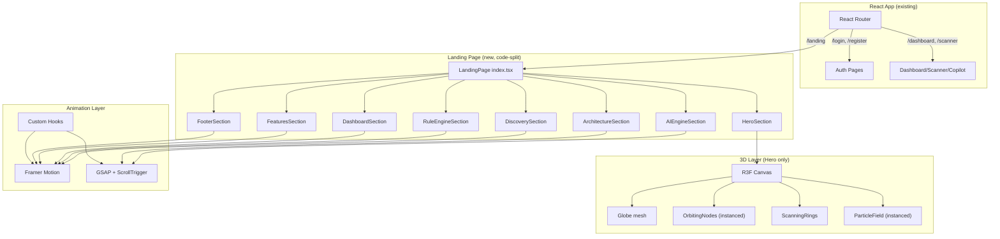
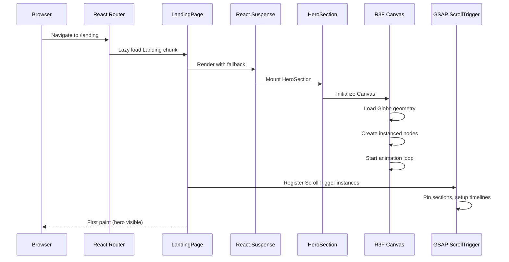
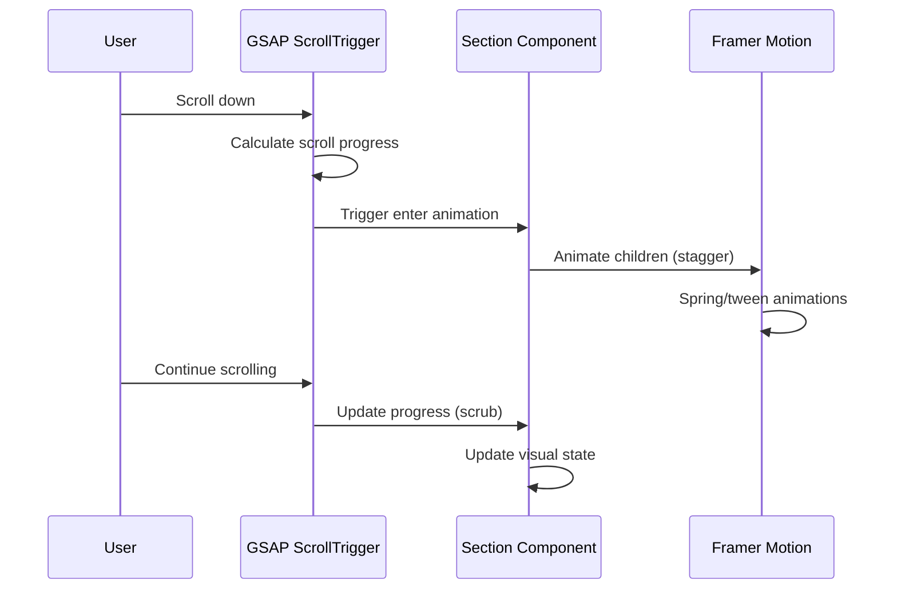
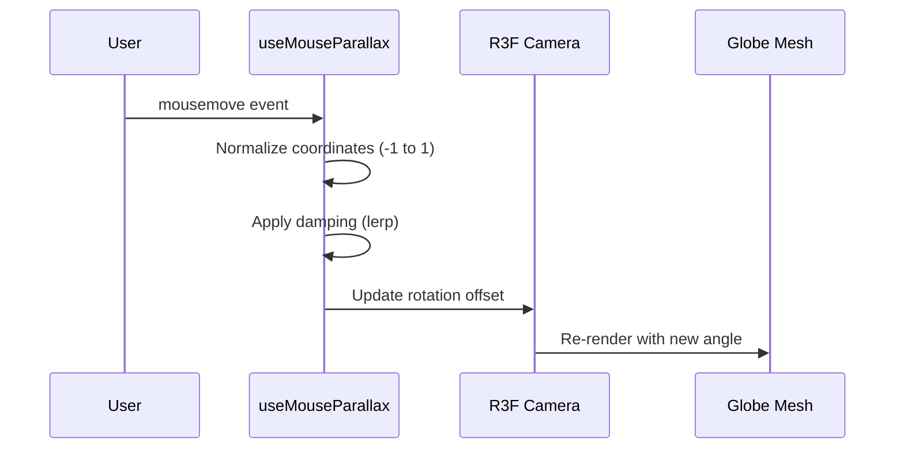

# Design Document: Immersive Landing Page

## Overview

CloudGuardian AI's immersive landing page is a cinematic, full-screen experience that showcases the platform's AI-powered cloud cost optimization capabilities through 3D visuals, scroll-driven animations, and interactive elements. The page is built as a new route (`/landing`) within the existing React client application, using React Three Fiber for the hero 3D globe, Framer Motion for component animations, and GSAP ScrollTrigger for scroll-driven timeline sequences.

The landing page consists of 8 distinct sections — each self-contained as its own component — progressing the visitor through CloudGuardian's value proposition: from cloud discovery, through rule-based analysis, AI-powered explanations, to a live dashboard preview. The design prioritizes a futuristic cybersecurity/cloud-ops-center aesthetic with an emerald/cyan/purple color palette on a deep dark background, avoiding any generic SaaS patterns.

Performance is maintained by isolating the React Three Fiber canvas to the Hero section only, lazy-loading 3D assets via React Suspense, using instanced meshes for particle systems, and code-splitting the entire landing page from the main app bundle.

## Architecture



## Sequence Diagrams

### Page Load & Initialization



### Scroll Interaction Flow



### Mouse Interaction on 3D Globe



## Components and Interfaces

### Component 1: LandingPage (index.tsx)

**Purpose**: Top-level page component that orchestrates all 8 sections, manages scroll state, and handles code-splitting boundary.

**Interface**:
```typescript
interface LandingPageProps {}

// Exported as lazy-loaded route component
const LandingPage: React.FC<LandingPageProps>
```

**Responsibilities**:
- Render all 8 sections in sequence
- Provide scroll context to children
- Initialize GSAP ScrollTrigger on mount
- Cleanup GSAP instances on unmount
- Handle smooth scrolling between sections

### Component 2: HeroSection

**Purpose**: Full-screen cinematic hero with 3D globe, orbiting AWS nodes, scanning rings, particle effects, and live metrics counters.

**Interface**:
```typescript
interface HeroSectionProps {
  className?: string;
}

interface MetricConfig {
  label: string;
  endValue: number;
  suffix: string;
  duration: number;
}
```

**Responsibilities**:
- Render React Three Fiber Canvas with Suspense fallback
- Display animated metrics counters
- Manage mouse-reactive camera
- Display CTA buttons and headline text
- Handle responsive layout (canvas size)

### Component 3: Globe (3D)

**Purpose**: Low-poly Earth mesh with glowing cloud network lines and emerald highlights.

**Interface**:
```typescript
interface GlobeProps {
  radius?: number;
  rotationSpeed?: number;
  wireframeOpacity?: number;
}
```

**Responsibilities**:
- Render icosphere geometry with wireframe overlay
- Apply emissive glow shader (emerald)
- Auto-rotate on Y axis
- React to mouse position via parent camera

### Component 4: OrbitingNodes (3D)

**Purpose**: AWS service icons orbiting the globe as instanced meshes with labels.

**Interface**:
```typescript
interface AWSNode {
  id: string;
  label: string;
  icon: string; // SVG path or sprite reference
  orbitRadius: number;
  orbitSpeed: number;
  orbitOffset: number; // phase offset in radians
  color: string;
}

interface OrbitingNodesProps {
  nodes: AWSNode[];
  globeRadius: number;
}
```

**Responsibilities**:
- Render instanced mesh for node icons
- Calculate orbital positions per frame
- Apply glow/pulse effect to active nodes
- Display labels via Drei Html component

### Component 5: DiscoverySection

**Purpose**: Animated visualization of resources flowing from AWS cloud into the Discovery Engine.

**Interface**:
```typescript
interface DiscoverySectionProps {
  className?: string;
}

interface ResourceStream {
  id: string;
  serviceName: string;
  icon: string;
  color: string;
  delay: number;
}
```

**Responsibilities**:
- Render animated data streams (SVG paths + Framer Motion)
- Show AWS service icons flowing along paths
- Trigger animations on scroll enter
- Display connection lines between services

### Component 6: RuleEngineSection

**Purpose**: Show resources entering an AI core and producing holographic finding cards.

**Interface**:
```typescript
interface Finding {
  id: string;
  title: string;
  severity: 'critical' | 'warning' | 'info';
  service: string;
  estimatedSavings: string;
  color: string;
}

interface RuleEngineSectionProps {
  className?: string;
}
```

**Responsibilities**:
- Render futuristic AI core visual (CSS/SVG animated)
- Animate finding cards appearing with stagger
- Apply holographic glass-card styling
- Show severity badges and savings estimates

### Component 7: AIEngineSection

**Purpose**: AI hologram visualization with typing animation showing problem → analysis → recommendation → CLI output.

**Interface**:
```typescript
interface AIStep {
  id: string;
  phase: 'problem' | 'analysis' | 'recommendation' | 'action';
  content: string;
  typingSpeed: number;
}

interface AIEngineSectionProps {
  className?: string;
}
```

**Responsibilities**:
- Render AI hologram visual (CSS gradient + animation)
- Sequence through AI analysis steps
- Typing animation for CLI/Terraform output
- GSAP scroll-scrub through phases

### Component 8: DashboardSection

**Purpose**: Live animated dashboard mockup with charts, savings counter, health score.

**Interface**:
```typescript
interface DashboardSectionProps {
  className?: string;
}

interface ChartDataPoint {
  label: string;
  value: number;
  color: string;
}
```

**Responsibilities**:
- Render mock dashboard UI (not a static image)
- Animate chart bars/lines on scroll enter
- Animate savings counter (useCountUp)
- Show health score radial gauge
- Display scrolling findings list

### Component 9: FeaturesSection

**Purpose**: 8 floating glass cards with independent hover/float animations showcasing platform features.

**Interface**:
```typescript
interface FeatureCard {
  id: string;
  title: string;
  description: string;
  icon: string;
  color: string;
  floatDelay: number;
  floatAmplitude: number;
}

interface FeaturesSectionProps {
  className?: string;
}
```

**Responsibilities**:
- Render 8 glass-morphism cards in responsive grid
- Apply independent floating animations (sin wave offset)
- Hover effects (scale, glow, border highlight)
- Staggered entrance on scroll

### Component 10: ArchitectureSection

**Purpose**: Horizontal animated pipeline showing the full CloudGuardian workflow.

**Interface**:
```typescript
interface PipelineStage {
  id: string;
  label: string;
  icon: string;
  description: string;
  color: string;
}

interface ArchitectureSectionProps {
  className?: string;
}
```

**Responsibilities**:
- Render horizontal pipeline with connecting lines
- GSAP scroll-scrub: highlight stages sequentially
- Animate connection lines with flowing particles
- Show stage descriptions on activation

### Component 11: FooterSection

**Purpose**: Premium enterprise footer with animated network background and social links.

**Interface**:
```typescript
interface FooterLink {
  label: string;
  href: string;
  icon?: string;
}

interface FooterSectionProps {
  className?: string;
}
```

**Responsibilities**:
- Render animated network dot grid (canvas or SVG)
- Display logo, navigation, social links
- Apply subtle parallax on scroll
- Responsive column layout

## Data Models

### Design System Constants

```typescript
interface DesignSystem {
  colors: {
    background: '#0B0F14';
    surface: '#111827';
    primary: '#10B981';
    secondary: '#22D3EE';
    accent: '#7C3AED';
    warning: '#F59E0B';
    critical: '#EF4444';
    text: '#F8FAFC';
    muted: '#94A3B8';
  };
  timing: {
    heroCounterDuration: 2500;
    sectionEnterDuration: 0.8;
    staggerDelay: 0.1;
    typingSpeed: 40;
    globeRotationSpeed: 0.002;
    particleCount: 200;
    nodeOrbitDuration: 20;
  };
  breakpoints: {
    sm: 640;
    md: 768;
    lg: 1024;
    xl: 1280;
  };
}
```

**Validation Rules**:
- All color values must be valid hex strings
- Timing values must be positive numbers
- particleCount must not exceed 500 (performance)
- Globe rotation speed must be between 0.001 and 0.01

### Section Configuration

```typescript
interface SectionConfig {
  id: string;
  component: React.LazyExoticComponent<React.FC>;
  scrollTrigger: {
    start: string;   // e.g., "top center"
    end: string;     // e.g., "bottom center"
    scrub: boolean | number;
    pin: boolean;
  };
  animation: {
    enter: MotionVariant;
    exit?: MotionVariant;
  };
}
```

### Metrics Data

```typescript
interface HeroMetric {
  id: string;
  label: string;
  value: number;
  prefix?: string;
  suffix: string;
  icon: string;
  color: string;
}

const HERO_METRICS: HeroMetric[] = [
  { id: 'resources', label: 'Resources Scanned', value: 2847, suffix: '+', icon: 'cloud', color: '#10B981' },
  { id: 'savings', label: 'Cost Saved', value: 142000, prefix: '$', suffix: '', icon: 'dollar', color: '#22D3EE' },
  { id: 'rules', label: 'Rules Active', value: 56, suffix: '', icon: 'shield', color: '#7C3AED' },
  { id: 'security', label: 'Security Checks', value: 1200, suffix: '+', icon: 'lock', color: '#F59E0B' },
];
```

## Algorithmic Pseudocode

### Globe Rendering Algorithm

```typescript
// useFrame hook - runs every frame (~60fps)
function updateGlobe(state: RootState, delta: number): void {
  // PRECONDITION: globe mesh ref is valid, delta > 0
  // POSTCONDITION: globe rotated by delta * speed, no frame drops

  const globe = globeRef.current;
  if (!globe) return;

  // Auto-rotation
  globe.rotation.y += delta * ROTATION_SPEED;

  // Mouse-reactive camera offset (lerped for smoothness)
  const targetX = mousePosition.y * MAX_TILT;
  const targetY = mousePosition.x * MAX_TILT;

  globe.rotation.x = lerp(globe.rotation.x, targetX, DAMPING);
  globe.rotation.z = lerp(globe.rotation.z, targetY * 0.5, DAMPING);
}
```

### Orbiting Nodes Position Algorithm

```typescript
// Calculate 3D position for each orbiting AWS node
function calculateNodePosition(
  node: AWSNode,
  elapsed: number
): [number, number, number] {
  // PRECONDITION: elapsed >= 0, node.orbitRadius > globeRadius
  // POSTCONDITION: returns valid [x, y, z] on orbital path
  // LOOP INVARIANT: each node maintains unique orbital phase

  const angle = (elapsed * node.orbitSpeed) + node.orbitOffset;
  const tilt = Math.sin(node.orbitOffset) * ORBIT_TILT;

  const x = Math.cos(angle) * node.orbitRadius;
  const y = Math.sin(tilt) * node.orbitRadius * 0.3;
  const z = Math.sin(angle) * node.orbitRadius;

  return [x, y, z];
}
```

### Scroll-Triggered Animation Algorithm

```typescript
// GSAP ScrollTrigger initialization for a section
function initSectionScrollTrigger(
  sectionEl: HTMLElement,
  timeline: gsap.core.Timeline,
  config: SectionConfig
): ScrollTrigger {
  // PRECONDITION: sectionEl is mounted in DOM, timeline has tweens
  // POSTCONDITION: ScrollTrigger instance registered and active

  return ScrollTrigger.create({
    trigger: sectionEl,
    start: config.scrollTrigger.start,
    end: config.scrollTrigger.end,
    scrub: config.scrollTrigger.scrub,
    pin: config.scrollTrigger.pin,
    animation: timeline,
    onEnter: () => timeline.play(),
    onLeave: () => timeline.pause(),
    onEnterBack: () => timeline.resume(),
  });
}
```

### Count-Up Animation Algorithm

```typescript
// Animated counter hook logic
function useCountUp(
  endValue: number,
  duration: number,
  startOnView: boolean
): { value: number; ref: RefObject<HTMLElement> } {
  // PRECONDITION: endValue > 0, duration > 0
  // POSTCONDITION: value animates from 0 to endValue over duration ms
  // LOOP INVARIANT: 0 <= currentValue <= endValue at all times

  const [value, setValue] = useState(0);
  const ref = useRef<HTMLElement>(null);

  useEffect(() => {
    if (!inView) return;

    const startTime = performance.now();

    function animate(currentTime: number) {
      const elapsed = currentTime - startTime;
      const progress = Math.min(elapsed / duration, 1);

      // Ease-out cubic for natural deceleration
      const eased = 1 - Math.pow(1 - progress, 3);
      const current = Math.round(eased * endValue);

      setValue(current);

      if (progress < 1) {
        requestAnimationFrame(animate);
      }
    }

    requestAnimationFrame(animate);
  }, [inView, endValue, duration]);

  return { value, ref };
}
```

### Particle System Algorithm

```typescript
// Instanced particle field update
function updateParticles(
  particles: Float32Array,
  velocities: Float32Array,
  count: number,
  delta: number
): void {
  // PRECONDITION: particles.length === count * 3, delta > 0
  // POSTCONDITION: all particles updated, wrapped within bounds
  // LOOP INVARIANT: particle positions stay within [-BOUNDS, BOUNDS]

  for (let i = 0; i < count; i++) {
    const i3 = i * 3;

    // Update position
    particles[i3] += velocities[i3] * delta;
    particles[i3 + 1] += velocities[i3 + 1] * delta;
    particles[i3 + 2] += velocities[i3 + 2] * delta;

    // Wrap around bounds
    if (Math.abs(particles[i3]) > BOUNDS) particles[i3] *= -1;
    if (Math.abs(particles[i3 + 1]) > BOUNDS) particles[i3 + 1] *= -1;
    if (Math.abs(particles[i3 + 2]) > BOUNDS) particles[i3 + 2] *= -1;
  }
}
```

### Typing Animation Algorithm

```typescript
// Character-by-character typing effect
function useTypingAnimation(
  text: string,
  speed: number,
  startTrigger: boolean
): { displayText: string; isComplete: boolean } {
  // PRECONDITION: text.length > 0, speed > 0 (ms per character)
  // POSTCONDITION: displayText grows from "" to full text
  // LOOP INVARIANT: displayText === text.substring(0, currentIndex)

  const [currentIndex, setCurrentIndex] = useState(0);

  useEffect(() => {
    if (!startTrigger) return;
    if (currentIndex >= text.length) return;

    const timer = setTimeout(() => {
      setCurrentIndex(prev => prev + 1);
    }, speed);

    return () => clearTimeout(timer);
  }, [currentIndex, text, speed, startTrigger]);

  return {
    displayText: text.substring(0, currentIndex),
    isComplete: currentIndex >= text.length,
  };
}
```

## Key Functions with Formal Specifications

### Function: initLandingAnimations()

```typescript
function initLandingAnimations(containerRef: RefObject<HTMLElement>): () => void
```

**Preconditions:**
- `containerRef.current` is a mounted DOM element
- GSAP and ScrollTrigger plugins are registered
- All section elements exist within container

**Postconditions:**
- All ScrollTrigger instances are created and active
- Returns cleanup function that kills all triggers
- No memory leaks on cleanup

**Loop Invariants:** N/A

---

### Function: createGlobeGeometry()

```typescript
function createGlobeGeometry(radius: number, detail: number): BufferGeometry
```

**Preconditions:**
- `radius` > 0 (typically 1.5-3.0)
- `detail` is integer between 2-5 (low-poly constraint)

**Postconditions:**
- Returns valid THREE.BufferGeometry
- Vertex count <= 1000 (performance budget)
- Geometry has position, normal, and uv attributes

**Loop Invariants:** N/A

---

### Function: useMouseParallax()

```typescript
function useMouseParallax(sensitivity: number): { x: number; y: number }
```

**Preconditions:**
- `sensitivity` is between 0.01 and 0.1
- Component is mounted (event listeners attached)

**Postconditions:**
- Returns normalized coordinates in range [-1, 1]
- Values are damped (no sudden jumps)
- Event listeners cleaned up on unmount

**Loop Invariants:**
- Output values always within [-1, 1] bounds after damping

---

### Function: useScrollAnimation()

```typescript
function useScrollAnimation(
  ref: RefObject<HTMLElement>,
  config: ScrollAnimationConfig
): { progress: number; isInView: boolean }
```

**Preconditions:**
- `ref.current` is a mounted DOM element
- `config.start` and `config.end` are valid GSAP trigger strings

**Postconditions:**
- `progress` is in range [0, 1] representing scroll position within trigger zone
- `isInView` is true only when element is within viewport trigger bounds
- ScrollTrigger instance is cleaned up on unmount

**Loop Invariants:**
- `progress` monotonically increases while scrolling down within trigger zone

## Example Usage

```typescript
// App.tsx - Adding the landing page route (code-split)
import { lazy, Suspense } from 'react';

const LandingPage = lazy(() => import('./pages/Landing'));

function App() {
  return (
    <AuthProvider>
      <Router>
        <Routes>
          <Route
            path="/landing"
            element={
              <Suspense fallback={<LoadingScreen />}>
                <LandingPage />
              </Suspense>
            }
          />
          {/* existing routes unchanged */}
        </Routes>
      </Router>
    </AuthProvider>
  );
}
```

```typescript
// pages/Landing/index.tsx - Main landing page
import { useRef, useEffect } from 'react';
import { gsap } from 'gsap';
import { ScrollTrigger } from 'gsap/ScrollTrigger';
import HeroSection from './components/Hero/HeroSection';
import DiscoverySection from './components/Discovery/DiscoverySection';
import RuleEngineSection from './components/RuleEngine/RuleEngineSection';
import AIEngineSection from './components/AIEngine/AIEngineSection';
import DashboardSection from './components/Dashboard/DashboardSection';
import FeaturesSection from './components/Features/FeaturesSection';
import ArchitectureSection from './components/Architecture/ArchitectureSection';
import FooterSection from './components/Footer/FooterSection';

gsap.registerPlugin(ScrollTrigger);

export default function LandingPage() {
  const containerRef = useRef<HTMLDivElement>(null);

  useEffect(() => {
    const ctx = gsap.context(() => {
      // ScrollTrigger setup for each section
    }, containerRef);

    return () => ctx.revert();
  }, []);

  return (
    <div ref={containerRef} className="bg-[#0B0F14] overflow-x-hidden">
      <HeroSection />
      <DiscoverySection />
      <RuleEngineSection />
      <AIEngineSection />
      <DashboardSection />
      <FeaturesSection />
      <ArchitectureSection />
      <FooterSection />
    </div>
  );
}
```

```typescript
// components/Hero/Globe.tsx - 3D Globe example
import { useRef } from 'react';
import { useFrame } from '@react-three/fiber';
import { Sphere, MeshDistortMaterial } from '@react-three/drei';
import * as THREE from 'three';

interface GlobeProps {
  radius?: number;
  rotationSpeed?: number;
}

export default function Globe({ radius = 2, rotationSpeed = 0.002 }: GlobeProps) {
  const meshRef = useRef<THREE.Mesh>(null);

  useFrame((_, delta) => {
    if (meshRef.current) {
      meshRef.current.rotation.y += delta * rotationSpeed;
    }
  });

  return (
    <group>
      {/* Main globe */}
      <Sphere ref={meshRef} args={[radius, 32, 32]}>
        <meshStandardMaterial
          color="#10B981"
          wireframe
          transparent
          opacity={0.3}
          emissive="#10B981"
          emissiveIntensity={0.2}
        />
      </Sphere>
      {/* Glow layer */}
      <Sphere args={[radius * 1.02, 32, 32]}>
        <meshBasicMaterial
          color="#10B981"
          transparent
          opacity={0.05}
          side={THREE.BackSide}
        />
      </Sphere>
    </group>
  );
}
```

```typescript
// hooks/useScrollAnimation.ts - Reusable scroll hook
import { useEffect, useRef, useState } from 'react';
import { gsap } from 'gsap';
import { ScrollTrigger } from 'gsap/ScrollTrigger';

interface ScrollAnimationConfig {
  start?: string;
  end?: string;
  scrub?: boolean | number;
}

export function useScrollAnimation(config: ScrollAnimationConfig = {}) {
  const ref = useRef<HTMLElement>(null);
  const [progress, setProgress] = useState(0);
  const [isInView, setIsInView] = useState(false);

  useEffect(() => {
    if (!ref.current) return;

    const trigger = ScrollTrigger.create({
      trigger: ref.current,
      start: config.start ?? 'top 80%',
      end: config.end ?? 'bottom 20%',
      scrub: config.scrub ?? false,
      onUpdate: (self) => setProgress(self.progress),
      onEnter: () => setIsInView(true),
      onLeave: () => setIsInView(false),
      onEnterBack: () => setIsInView(true),
      onLeaveBack: () => setIsInView(false),
    });

    return () => trigger.kill();
  }, [config.start, config.end, config.scrub]);

  return { ref, progress, isInView };
}
```

```typescript
// components/Features/GlassCard.tsx - Floating glass card
import { motion } from 'framer-motion';

interface GlassCardProps {
  title: string;
  description: string;
  icon: string;
  color: string;
  index: number;
}

export default function GlassCard({ title, description, icon, color, index }: GlassCardProps) {
  return (
    <motion.div
      initial={{ opacity: 0, y: 40 }}
      whileInView={{ opacity: 1, y: 0 }}
      transition={{ delay: index * 0.1, duration: 0.6 }}
      whileHover={{ scale: 1.05, boxShadow: `0 0 30px ${color}33` }}
      animate={{ y: [0, -8, 0] }}
      className="relative p-6 rounded-2xl border border-white/10
                 bg-white/5 backdrop-blur-xl"
      style={{ animationDelay: `${index * 0.3}s` }}
    >
      <div className="text-3xl mb-4" style={{ color }}>{icon}</div>
      <h3 className="text-lg font-semibold text-[#F8FAFC] mb-2">{title}</h3>
      <p className="text-sm text-[#94A3B8]">{description}</p>
    </motion.div>
  );
}
```

## Correctness Properties

*A property is a characteristic or behavior that should hold true across all valid executions of a system — essentially, a formal statement about what the system should do. Properties serve as the bridge between human-readable specifications and machine-verifiable correctness guarantees.*

### Property 1: Particle Bounds Invariant

*For any* particle array and *for any* sequence of update cycles with arbitrary velocities and delta times, all particle positions SHALL remain within the defined bounds [-BOUNDS, BOUNDS] on each axis after the update function executes.

**Validates: Requirement 2.7**

### Property 2: Counter Monotonicity and Boundedness

*For any* positive end value and positive duration, the count-up animation SHALL produce a sequence of values that is monotonically non-decreasing and bounded within [0, endValue] at every point during the animation.

**Validates: Requirements 2.9, 10.3**

### Property 3: Mouse Parallax Normalization

*For any* mouse event coordinates (including extreme or negative values), the useMouseParallax hook SHALL return x and y values clamped to the range [-1, 1].

**Validates: Requirements 2.11, 10.4**

### Property 4: Scroll Progress Range

*For any* scroll position (including before, within, and after the trigger zone), the useScrollAnimation hook SHALL return a progress value in the range [0, 1].

**Validates: Requirement 10.1**

### Property 5: Typing Animation Prefix Invariant

*For any* non-empty text string and positive typing speed, the useTypingAnimation hook SHALL produce displayed text that is always a prefix of the full text (starting from empty string and ending at the complete string), with each step adding exactly one character.

**Validates: Requirements 5.3, 10.5**

### Property 6: Orbital Position Validity

*For any* node configuration (orbit radius, speed, offset) and *for any* elapsed time value, the calculateNodePosition function SHALL return a 3D point that lies on the expected orbital path at the correct radius from the origin.

**Validates: Requirement 2.4**

### Property 7: No Horizontal Overflow

*For any* viewport width of 320px or greater, the Landing_Page layout SHALL produce no horizontal overflow (document scrollWidth <= viewport width).

**Validates: Requirement 12.1**

### Property 8: External Link Security Attributes

*For any* external link rendered in the Footer_Section, the anchor element SHALL have `rel="noopener noreferrer"` set.

**Validates: Requirement 9.3**

## Error Handling

### Error Scenario 1: WebGL Context Lost

**Condition**: GPU driver crash, tab backgrounded too long, or resource exhaustion
**Response**: Catch `webglcontextlost` event on canvas. Display a static fallback hero image with CSS gradient background. Hide 3D elements gracefully.
**Recovery**: Listen for `webglcontextrestored` event. Re-initialize R3F canvas if context is restored.

### Error Scenario 2: 3D Asset Loading Failure

**Condition**: Network timeout or geometry/texture fails to load
**Response**: React Suspense boundary catches the suspended promise. Display a minimal animated fallback (CSS-only globe wireframe using border-radius + rotation).
**Recovery**: Retry loading on next navigation to the page. No persistent error state.

### Error Scenario 3: GSAP ScrollTrigger Miscalculation

**Condition**: Dynamic content height changes after ScrollTrigger initialization (lazy images, fonts loading)
**Response**: Call `ScrollTrigger.refresh()` after all content is settled (useLayoutEffect + font load callback).
**Recovery**: Automatic — refresh recalculates all trigger positions.

### Error Scenario 4: Performance Degradation

**Condition**: Frame rate drops below 30 FPS on low-end devices
**Response**: Detect via `requestAnimationFrame` timing. Reduce particle count, disable 3D scene, fall back to 2D CSS animations only.
**Recovery**: Store preference in localStorage. On next visit, skip 3D initialization for known low-performance device.

### Error Scenario 5: Reduced Motion Preference

**Condition**: User has `prefers-reduced-motion: reduce` enabled
**Response**: Disable all parallax, particle, floating, and scroll-scrub animations. Show static versions of all sections. Keep basic fade-in transitions only.
**Recovery**: N/A — this is a permanent user preference, not an error. Respect it throughout.

## Testing Strategy

### Unit Testing Approach

- Test custom hooks (`useCountUp`, `useMouseParallax`, `useScrollAnimation`) with React Testing Library + `renderHook`
- Test utility functions (`animations.ts`, `constants.ts`) with unit assertions
- Test component rendering (each section renders without errors)
- Mock `@react-three/fiber` and `gsap` in unit tests
- Coverage goal: 80% for hooks/utils, 60% for components

### Property-Based Testing Approach

**Property Test Library**: fast-check

- **Counter values**: For any `endValue` and `duration`, the counter never exceeds `endValue` and always reaches it
- **Mouse normalization**: For any mouse coordinates (x, y), output is always in [-1, 1]
- **Particle bounds**: After any number of update cycles, particles remain within bounds
- **Scroll progress**: For any scroll position, progress is always in [0, 1]
- **Color validation**: All design system colors are valid 6-character hex strings

### Integration Testing Approach

- Test that the landing page route loads correctly via React Router
- Test that code splitting produces a separate chunk
- Test scroll-driven animations fire at correct scroll positions (Cypress or Playwright)
- Test responsive layout at key breakpoints (320px, 768px, 1024px, 1280px)
- Test reduced-motion media query disables animations
- Visual regression testing for key sections

## Performance Considerations

| Concern | Strategy | Budget |
|---------|----------|--------|
| 3D Globe rendering | Low-poly icosphere (detail=3), instanced meshes for nodes | < 1000 vertices |
| Particle system | InstancedMesh with Float32Array, no individual objects | ≤ 200 particles |
| Bundle size | Code-split landing page, tree-shake Three.js | < 250KB gzipped for landing chunk |
| Scroll animations | GSAP will-change hints, GPU-accelerated transforms only | 60 FPS maintained |
| Images | No raster images — all SVG/CSS/WebGL | 0 image requests |
| Font loading | System font stack + preloaded WOFF2 for heading font | < 50KB fonts |
| Initial paint | Hero section renders first, below-fold sections lazy | LCP < 2.5s |
| Memory | Cleanup all Three.js geometries/materials on unmount | No memory leaks |

## Security Considerations

- No external API calls from the landing page (purely client-side rendering)
- No user data collection on landing page (no forms, no cookies until auth)
- All external links (GitHub, LinkedIn) use `rel="noopener noreferrer"`
- CSP headers should allow `blob:` and `data:` URIs for Three.js textures
- No inline scripts — all code bundled via Vite

## Dependencies

| Package | Version | Purpose |
|---------|---------|---------|
| `@react-three/fiber` | ^8.15.0 | React renderer for Three.js (3D globe) |
| `@react-three/drei` | ^9.88.0 | Helpers: Html, Sphere, Float, Stars |
| `three` | ^0.160.0 | 3D engine (peer dep for R3F) |
| `@types/three` | ^0.160.0 | TypeScript types for Three.js |
| `framer-motion` | ^10.16.0 | Component enter/exit animations |
| `gsap` | ^3.12.0 | ScrollTrigger, timelines, scrubbing |

**Note**: The existing project uses JSX. The landing page will be authored in TypeScript (`.tsx`). Vite supports mixed JS/TS out of the box — no config changes needed beyond ensuring `@types/react` is installed (already present in devDependencies).
